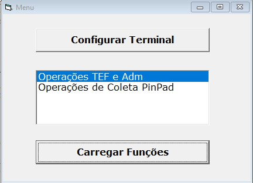
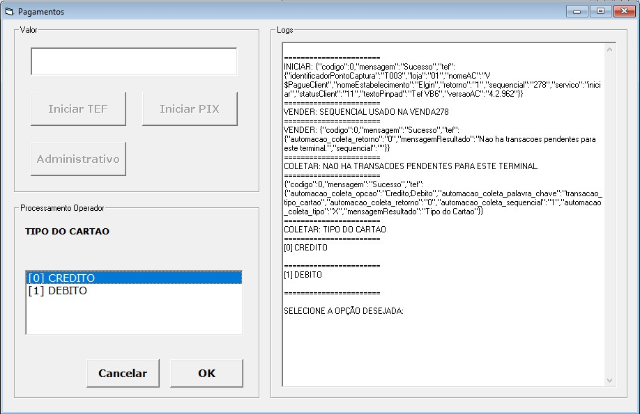
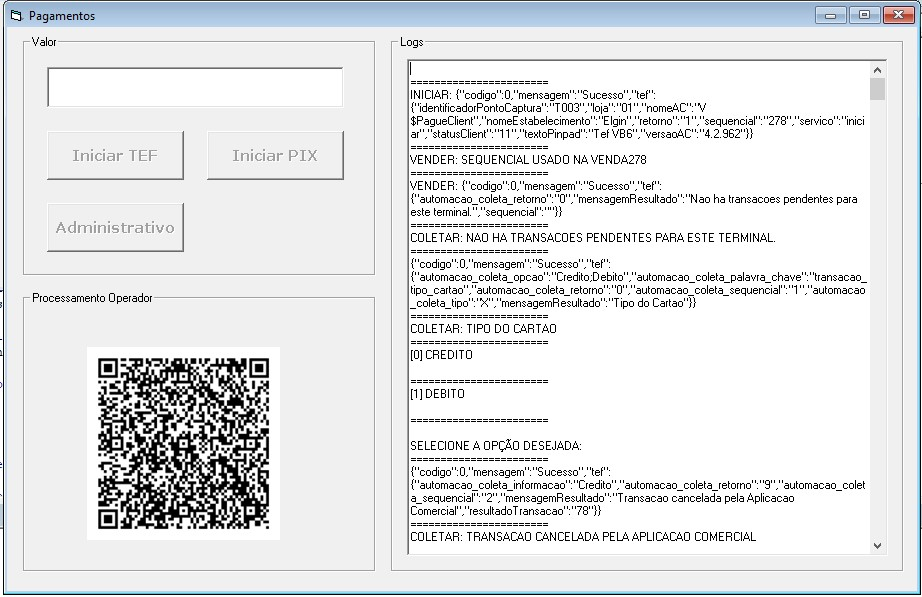
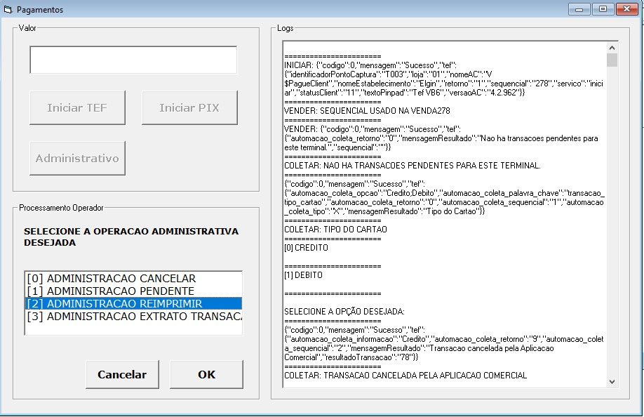

# Exemplo VB6 API TEF Elgin #

## Documentação 
Para compreender o funcionamento da API usar como referência a [documentação](https://elgindevelopercommunity.github.io/group__t2.html).

## Exemplos VB6 para utilizar a API do Tef Elgin.

Para o exemplo foram usadas as seguintes bibliotecas:
- [E1_Tef01.dll](https://github.com/ElginDeveloperCommunity/TEF-Elgin/tree/master/Biblioteca), depende da instalação dos programas neste [link.](https://github.com/ElginDeveloperCommunity/TEF-Elgin/tree/master/Instaladores)
- [JsonBag](https://www.vbforums.com/showthread.php?738845-VB6-JsonBag-Another-JSON-Parser-Generator&p=5079709&viewfull=1#post5079709)
- modGDIPlusResize

## Requisitos para Teste ##
Antes de poder testar o exemplo, instalar todos os componentes necessários descritos na [documentação de instalação](https://github.com/ElginDeveloperCommunity/TEF-Elgin/blob/master/Instaladores_Windows/Homologa%C3%A7%C3%A3o/Manual%20instala%C3%A7%C3%A3o%20TEF%20Elgin_HOMOLOGA%C3%87%C3%83O_Ajustado.pdf).

## Imagens do Programa ##

