# TEF GP

- [Glossário](#glossário)
- [Instalação do Elgin TEF GP](#instalação-do-elgin-tef-gp)
- [Configurações do GP](#configurações-do-gp)

## Glossário

* **TEF GP**: [`TEF Gerenciador Padrão`](https://elgindevelopercommunity.github.io/group__t0.html) também conhecido como `TEF Troca de Arquivos`
* **E1 Connect**: Módulo que permite o uso do [`TEF Web`](https://elgindevelopercommunity.github.io/group__g14.html)
* **TEF Autônomo**: Software de pagamento autônomo. Permite que Software Houses possam usar facilmente pagamento mesmo sem ter uma integração com seu software. O usuário (atendente) pode realizar pagamentos diretamente pelo GP sem a necessidade de uma integração por parte da Automação Comercial.

## Instalação do Elgin TEF GP

Para instalar o **Elgin TEF GP** baixar o arquivo `E1_TEFPassivo-x.exe` e executar em seguida.
 
Será aberta a página inicial do instalador. Se desejar poderá escolher um caminho específico onde instalar o programa, porém aconselhável deixar o caminho padrão, e clicar em `Avançar`
 

 
 
Nesta tela do instalador, é possível escolher quais módulos serão instalados. 
O TEF GP padrão pode ser instalado selecionando as opções `Instala gerenciador padrão` e `Cliente TEF`, aqui é possível escolher `Homologação` ou `Produção`. 
No caso de querer usar o `TEF Web`, selecionar também a opção `Instala componente E1_Connect`. 
E então clique em avançar
 

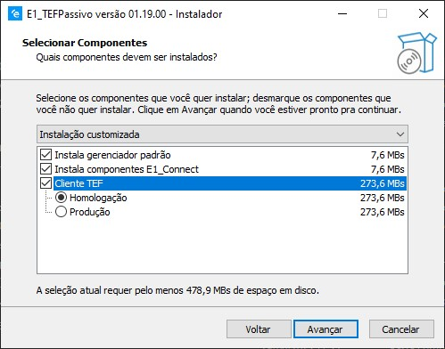

 
 
Aqui poderá escolher se ter um atalho na área de trabalho, isso facilitará para poder iniciar o TEF GP caso seja necessário.
 

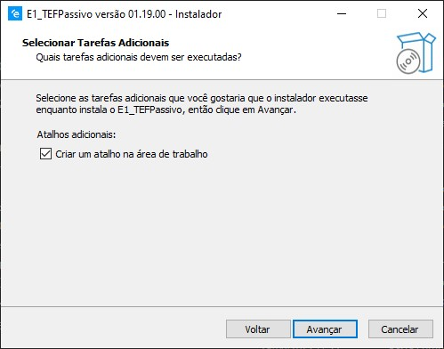

 
 
Nesta tela poderá revisar as opções escolhidas e caso deseje mudar algo, clique em `Voltar`, se não, clique em `Avançar`
 

 
 
Caso tenha sido escolhido a opção de instalar o **E1_Connect**, um segundo instalador aparecerá na tela, e então basta prosseguir com o processo de instalação padrão.
 

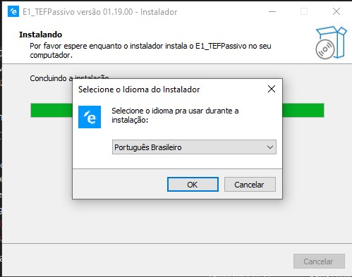

 
 
Se desejar poderá escolher um caminho específico onde instalar o E1_Connect, porém aconselhável deixar o caminho padrão, e clicar em `Avançar`
 

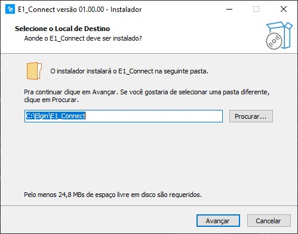

 
 
Aqui poderá escolher se ter um atalho na área de trabalho, isso facilitará para poder iniciar o E1_Connect caso seja necessário.
 

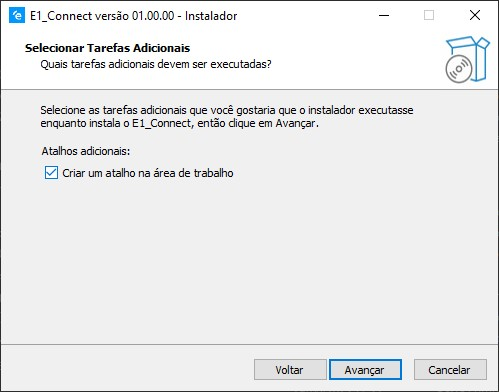

 
 
Nesta tela poderá revisar as opções escolhidas e caso deseje mudar algo, clique em `Voltar`, se não, clique em `Avançar`
 

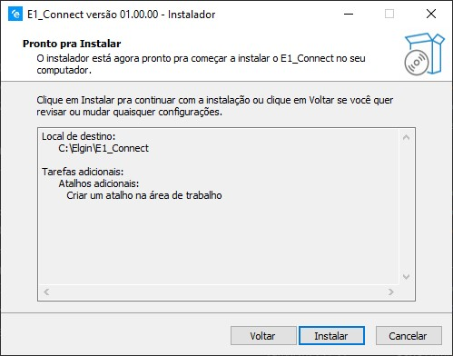

 
 
Concluir a instalação no E1_Connect.
 

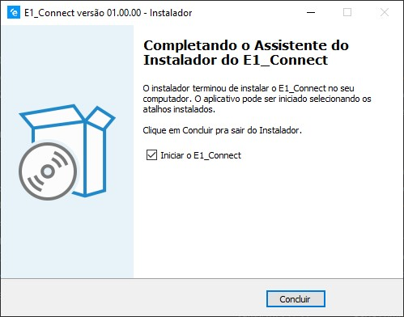

 
 
Concluir a instalação do TEF GP
 

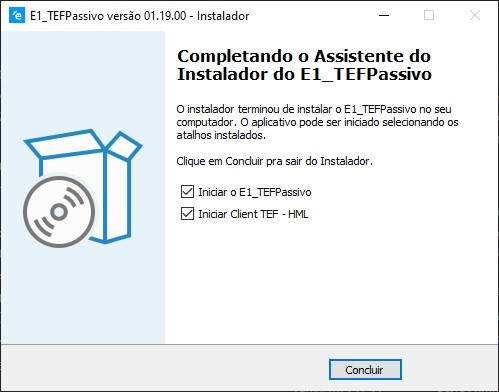

### Observações

Caso não seja selecionada a opção para criar um atalho na área de trabalho e for necessário iniciar o TEF GP ou o E1_Connect, será necessário ir no caminho em que os programas foram instalados e executar o executável a partir de lá. Se o caminho padrão tiver sido escolhido na hora da instalação, os caminhos do TEF GP e do E1_Connect serão respectivamente:  
TEFGP: `C:\ELGIN\TEFPassivo\E1_TEFPay_Passivo.exe`  
E1_Connect: `C:\ELGIN\E1_Connect\E1_Connect.exe`  

 
A tela do TEF Autônomo sempre vai ficar aberta, quando for cliado o botão **Cancelar** o GP é minimazo, e se clicar no "X" o GP irá encerrar. Para reabri será necessário clicar duas vezes no atalho criado na área de trabalho ou então diretamente no executável na pasta de instalação.

## Configurações do GP

Para acessar as configurações do TEF GP, clique no "reloginho" a direita inferior do windows 10, e selecione com o botão direito o ícone da Elgin, aparecerá um menu, então clique em `Configurações`

 

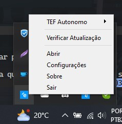

### Configurações Gerais

* Aqui como padrão estará selecionada a opção `Troca de Arquivos` em **Tipo de Operação**, porém poderá também ser escolhida a opção `Autônoma`, que se selecionada, após salvar, fará o GP entrar em modalidade de TEF Autônomo. 
Nesse caso é possível também configurar a impressão explicada [aqui](impressão-tef-autônomo).
* A opção **Configuração de log** habilitará ou desabilitará os logs do TEF GP
* **Configuração para display secundário** servirá para quando em uma transação PIX mostrar o QRCode da transação em um dispositivo **Pix4**.

 
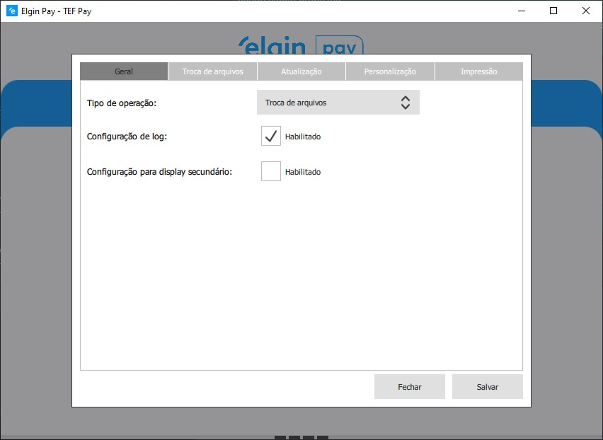

### Troca de arquivos

Nessa página são escolhidos os caminhos e nomes dos arquivos que serão usados para realizar a `troca de arquivos` entre o TEF GP e a Automação Comercial.
Também é possível configurar o comprovante, e opções de TAG028-001 e áspas no comprovante.

 
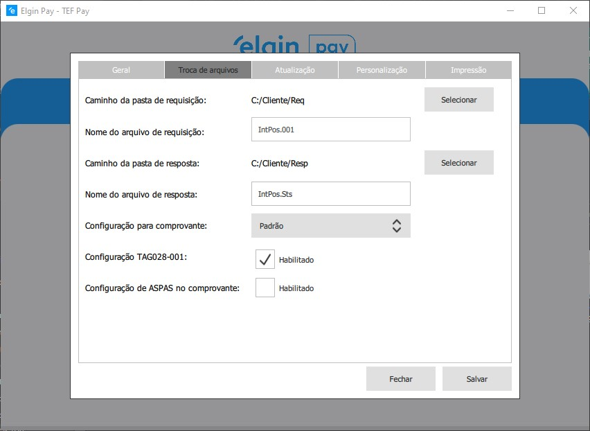

### Atualicação

* **Atualização do Sistema**: se refere à opção de "Verificar Atualização" no menu que aparece quando se clica com o botão direito no ícone da Elgin no "reloginho". Se selecionada, a opção no menu não aparecerá.
* **Configuração de atualização**: quando selecionada, irá realizar a atualização automática do Gerenciador Padrão sempre que ele for iniciado.

 
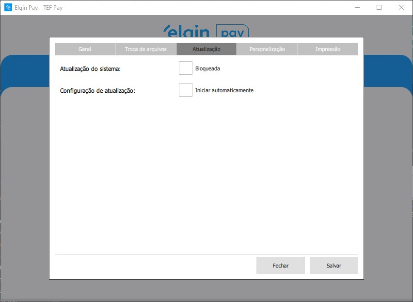

### Personalização

Nessa página é possível personalizar o TEF GP como um whitelabel. Colocando suas cores e sua logo. A logo ficará gravado o caminho da imagem selecionada.

 
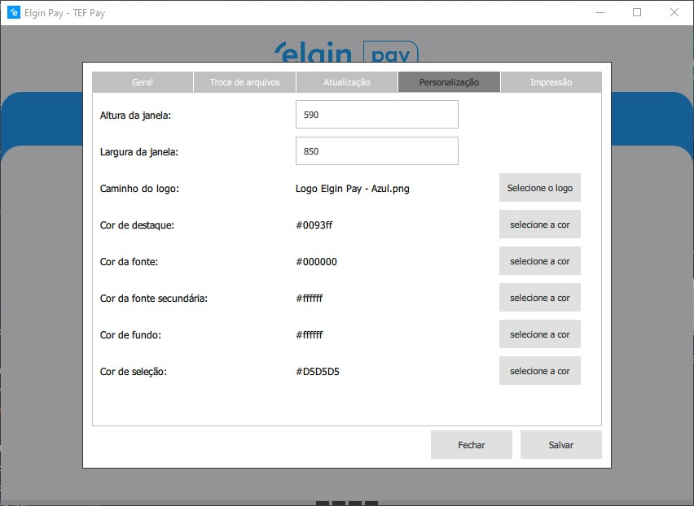

### Impressão TEF Autônomo

No caso do TEF Autônomo, poderá ser configurada a impressão automática do comprovante ao finalizar a venda. Aqui são feitas as configurações para isso.

* **Habilita Impressão**: habilita / desabilita a impressão
* **Configuração de Impressão**: aqui poderá ser selecionada a opção `Impressoras Elgin/Bematech` que irá realizar a impressão em qualquer impressora Elgin ou Bematech, conectadas tanto via porta serial como USB. Outras impressoras instaladas no windows via spooler também poderão ser usadas.
* **Gerar PDF**: habilita / desabilita a geração de PDFs
* **Caminho para arquivos PDF**: os PDFs são criados em pastas organizadas por datas, porém você pode escolher onde guardar essas pastas selecionando um caminho nessa opção.

 
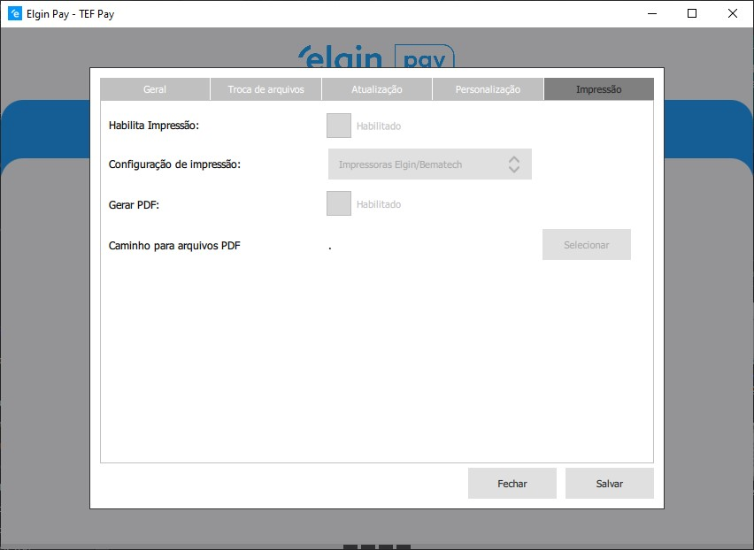